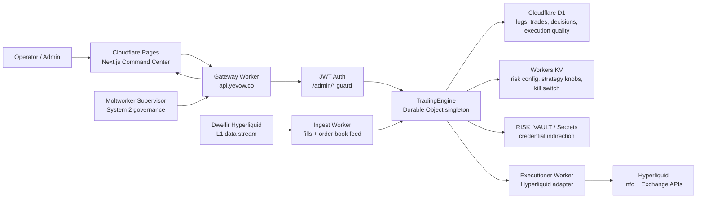

# Sovereign-Sigma

Sovereign-Sigma is a Cloudflare-native trading engine and command center.

- Core: Cloudflare Worker plus Durable Object trading engine
- Ingest: Cloudflare Worker market-data stream ingestor
- Executioner: Cloudflare Worker exchange adapter
- UI: Next.js static export deployed to Cloudflare Pages
- Storage: D1 for audit/trade logs, KV for global config and risk controls

## Public Architecture



The public deployment is split into three Worker roles:

- `sovereign-sigma-core`: authenticated API gateway plus the `TradingEngine` Durable Object brain.
- `sovereign-sigma-ingest`: market-data coordinator that forwards normalized Hyperliquid/Dwellir events into the Durable Object.
- `sovereign-sigma-executioner`: exchange adapter for signed order, cancel, account, and shadow-execution flows.

The command center is intentionally static and talks to the API over authenticated REST and WebSocket routes. Strategy controls and raw inspection tables live in `/settings`; the dashboard is reserved for live operating telemetry.

## Agent Overview

| Agent | Responsibility | Output |
| --- | --- | --- |
| Oracle | Classifies regime, estimates volatility, and produces posterior price distributions. | Regime state, skepticism multiplier, posterior PDF, ensemble vote. |
| Profiler | Tracks AM-VPIN, order-book imbalance, whale prints, spoofing, and cascade risk. | Toxicity state, quote halt signals, defensive alerts. |
| Croupier | Computes expected value and builds post-only market-making quotes using inventory-aware skew. | Trade intent, reservation price, quote orders. |
| Pit Boss | Applies Kelly sizing, inventory caps, drawdown controls, asset allocation, and final risk approval. | Approved/rejected execution plan and risk rationale. |
| Sentiment | Optional Workers AI or rule-based headline bias. | Sentiment score, confidence, cost/latency telemetry. |
| Executioner | Converts approved intents into exchange-compatible signed or shadow orders. | Execution reports, fill/ack state, slippage inputs. |
| Governor | Applies Moltworker/admin macro bias and temporary overrides. | Effective config, strategic bias, override audit trail. |
| Janitor | Keeps hot state, D1 rows, telemetry buffers, and order maps clean. | Cleanup reports and retention enforcement. |

All agents emit structured telemetry into the internal bus and D1 audit trail. The engine is designed to keep market-data ingestion alive even when execution is disabled, so paper/shadow replay can continue while live capital remains gated.

## Live Surfaces

- API: `https://api.yevow.co`
- Command Center: `https://app.yevow.co`
- Settings Console: `https://app.yevow.co/settings`
- Ingest Worker: `https://sovereign-sigma-ingest.woveyyevow.workers.dev`
- Executioner Worker: `https://sovereign-sigma-executioner.woveyyevow.workers.dev`

## Local Validation

```bash
npm ci
npm ci --prefix web
npm run typecheck
npm run web:typecheck
npm run web:build
npx wrangler deploy --dry-run
npx wrangler deploy --config wrangler.ingest.toml --dry-run
npx wrangler deploy --config wrangler.executioner.toml --dry-run
```

## GitHub Deployment

GitHub CI and manual Cloudflare deployment workflows live in `.github/workflows`.

See `docs/github-cloudflare-setup.md` for the GitHub Secrets, production environment, and deployment flow.

Alerting setup and verification lives in `docs/alerting-setup.md`.
Moltworker supervisor setup lives in `docs/moltworker-supervisor.md`.

Cloudflare Pages deploys use `web/wrangler.toml` as the Pages-specific
configuration source. The Command Center is a static Next.js export and uploads
from `web/out`.

## Tokyo Placement Policy

The production Workers use Cloudflare placement hints toward AWS Tokyo
(`aws:ap-northeast-1`) and create the stateful Durable Object singleton with an
`apac` location hint. Runtime golden-colo policy treats Tokyo/Narita (`NRT`) as
the preferred Cloudflare colo for Hyperliquid/Dwellir latency accounting.

## Dwellir Hyperliquid Ingest

Production ingest is subscription-aware. Shared/Enterprise Dwellir routes use
gRPC for fills plus the Dwellir L4 order-book server for book state:
`DWELLIR_GRPC_STREAMS=FILLS`, `DWELLIR_ORDERBOOK_TRANSPORT=websocket`, and
`DWELLIR_ENABLE_L4_BOOK=true`. Dedicated-node deployments can flip the book
transport to `grpc` for `ORDERBOOK_SNAPSHOT,FILLS`. The active asset matrix is
`BTC,ETH,HYPE,SOL`. The protobuf compiler fails closed if provider schema files
are missing, so the Worker cannot silently deploy with an empty placeholder
descriptor.

## Safety Defaults

The repository is designed to fail closed:

- `TRADING_ENABLED` should stay false until intentionally enabled through the authenticated admin API.
- `EXCHANGE_ORDER_TEST_MODE` is true by default for Hyperliquid signed-payload validation.
- Hyperliquid live execution requires an approved API wallet/agent, never the main fund-holding wallet private key.
- No API credentials or runtime secrets belong in source control.
- Runtime secrets should live in Cloudflare Worker Secrets when possible; the Settings Console can stage encrypted `RISK_VAULT` credentials for operator rotation workflows, and execution uses env secrets first with vault fallback.

## Hyperliquid Secrets

```bash
wrangler secret put HL_AGENT_ADDRESS -c wrangler.executioner.toml
wrangler secret put HL_AGENT_SECRET -c wrangler.executioner.toml
wrangler secret put HL_ACCOUNT_ADDRESS -c wrangler.executioner.toml
```

Leave `EXCHANGE_ORDER_TEST_MODE=true` until account reads pass and a signed order/cancel payload has been reviewed against Hyperliquid.
